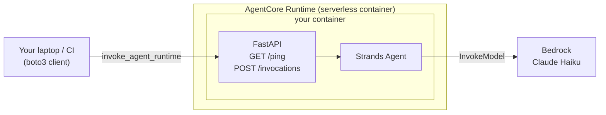

# Dessertifier — an AgentCore + Strands discovery exercise

Name a savory dish. Get back a *dessert* version of it — with every original
ingredient still intact. Anchovies stay anchovies, BBQ sauce stays BBQ sauce;
they just get candied, whipped, or folded into meringue. The results are
absurd on purpose.

The interesting bit: the model will happily *claim* it kept every ingredient
and then quietly drop the unpleasant ones. To force it to actually keep them,
the agent has to loop: draft a recipe, ask a tool which ingredients are still
present, add back whatever's missing, check again, done. That's a real agent
loop in about 60 lines of Python.

The task is silly so the fun bit is the plumbing: **you'll ship a real LLM
agent to AWS in about an hour.**

## What is all this stuff? (read this if any of these words are new)

You'll touch about ten different tools in this exercise. Here's what each one
is and why it's in the stack — you don't need to memorize this, just skim it
so nothing feels like magic.

### The agent brain

- **Amazon Bedrock** — AWS's API for calling large language models (Claude,
  Nova, Llama, etc.) without hosting them yourself. You call an HTTPS endpoint,
  AWS runs the inference, you pay per token. Our agent uses it to call Claude.
- **Claude Haiku 4.5** — the specific model we call through Bedrock. Small,
  cheap, fast. Good enough for a toy agent; you can swap in Sonnet later.
- **Strands Agents SDK** — open-source Python framework from AWS. You write
  `Agent(model=..., system_prompt=..., tools=[...])` and Strands runs the
  agent loop for you: call the model → run whichever tools the model asked
  for → feed results back → repeat until the model returns a final answer.
  This is how the agent logic fits in 30 lines instead of 300.

### The plumbing around the brain

- **FastAPI** — a Python web framework. You decorate a function with
  `@app.post("/invocations")` and FastAPI turns it into an HTTP endpoint that
  can accept JSON, validate it, and return JSON. Think Flask but modern and
  async. AgentCore Runtime requires our container to expose exactly two HTTP
  routes (`GET /ping` and `POST /invocations`); FastAPI is how we do that.
- **uvicorn** — the actual web server that runs a FastAPI app. FastAPI defines
  the routes; uvicorn is what listens on port 8080 and speaks HTTP. When you
  run `uvicorn app:app`, uvicorn imports your `app.py`, finds the `app`
  object, and serves it. (In production people often put nginx or an
  Application Load Balancer in front; for AgentCore, uvicorn on its own is
  fine because AgentCore itself handles TLS and routing.)
- **Docker** — packages our code + Python + its dependencies into a single
  portable image. AgentCore Runtime pulls that image and runs it as a
  container. `Dockerfile` describes what goes in.
- **`docker buildx` + ARM64** — AgentCore Runtime only accepts `linux/arm64`
  images (cheaper compute). Most laptops and Codespaces are x86_64, so we
  need cross-architecture builds. `buildx` is Docker's cross-build system;
  under the hood it uses QEMU to emulate ARM64. First build is slow (~3–5
  min), then it caches.
- **ECR (Elastic Container Registry)** — AWS's private Docker registry.
  You push an image here; AgentCore Runtime pulls it from here. It's just
  Docker Hub, but inside your AWS account.
- **Amazon Bedrock AgentCore Runtime** — a serverless container host purpose-
  built for agents. You give it "here's my image in ECR" and it handles
  running the container, scaling it, terminating it when idle, TLS, auth,
  logging, session routing. You never SSH into a box. The contract with your
  container is minimal: expose `POST /invocations` and `GET /ping` on port
  8080, that's it.
- **Terraform** (the `aws` provider) — infrastructure as code. Instead of
  clicking around the AWS console, you describe the resources you want
  (an IAM role, an AgentCore runtime, etc.) in `.tf` files and Terraform
  makes reality match. `aws_bedrockagentcore_agent_runtime` is the specific
  resource type we deploy. This is how you ship agents at work.
- **boto3** — the official Python SDK for AWS. Every AWS API has a boto3
  client. We use `boto3.client("bedrock-agentcore")` to actually invoke our
  deployed agent from a Python script.
- **CloudWatch Logs** — AWS's log aggregator. Anything your container writes
  to stdout/stderr ends up in a CloudWatch log group. We tail it with
  `aws logs tail --follow` to watch requests in real time.

By the end you'll have deployed a containerized agent, invoked it from the
CLI, watched the logs in CloudWatch, and torn it all down. Every piece here
is what teams actually use in production agent deployments.

---

## Prerequisites (5 min)

Before you touch anything:

1. **Open this repo in your Codespace.**

2. **Pick your unique per-student suffix.** Every attendee deploys into the
   same shared AWS account, so every ECR repo, IAM role, and AgentCore
   runtime is scoped by a per-student suffix. Pick your initials plus
   something distinctive — letters, digits, or underscores only, no hyphens,
   max 16 chars. Then export it in your shell so every command below picks
   it up:
   ```bash
   export SUFFIX=gb42              # your initials + something clever
   export TF_VAR_suffix=$SUFFIX    # Terraform reads TF_VAR_* automatically
   ```
   Every `${SUFFIX}` in this doc expands to the value you just set. If you
   open a fresh terminal, re-export both variables.

3. **Install the AWS CLI v2.** The Codespace base image doesn't ship it. In
   the Codespace terminal:
   ```bash
   cd /tmp
   curl "https://awscli.amazonaws.com/awscli-exe-linux-x86_64.zip" -o "awscliv2.zip"
   unzip awscliv2.zip
   sudo ./aws/install
   ```
   Verify:
   ```bash
   aws --version    # aws-cli/2.x.x
   ```

4. **Configure AWS credentials.**
   ```bash
   aws configure                     # region: us-east-1 is safest for Bedrock
   aws sts get-caller-identity       # sanity check
   ```

5. **Sanity-check the rest of the toolchain** (all preinstalled by the
   devcontainer):
   ```bash
   docker buildx version    # buildx (for ARM64 builds)
   terraform version        # >= 1.6
   python3 --version        # >= 3.11
   ```

> **Cost warning:** ECR storage is cents. AgentCore charges per invocation.
> Claude Haiku is ~$0.0001 per short call. If you finish the exercise and run
> the cleanup at the end, total spend is under $0.10. **Don't skip cleanup.**

---

## The mental model (2 min — read this before you start)



Your container just needs to speak HTTP on `POST /invocations` and `GET /ping`.
Everything else — TLS, auth, logging, autoscaling — is AgentCore's problem.
We use **FastAPI** for those two endpoints and **Strands** as the agent brain
behind them.

---

## Step 1 — Build the agent locally (20 min)

The whole agent is in [`agent/app.py`](agent/app.py). Read it — it's under 60
lines. The important bits:

- `FastAPI()` with two routes: `GET /ping` (health check) and `POST /invocations`
  (the actual work). These are the two routes AgentCore requires.
- `Agent(model=..., system_prompt=..., tools=[...])` — the Strands agent object.
- `@tool` — decorator that exposes a plain Python function to the LLM. The
  docstring is what the model sees when deciding whether to call the tool.

### Run it locally

```bash
cd agent
python3 -m venv .venv
source .venv/bin/activate
pip install -r requirements.txt

uvicorn app:app --host 0.0.0.0 --port 8080 &

# Give it a second to boot, then:
curl -s http://localhost:8080/ping                    # {"status":"Healthy"}

curl -s -X POST http://localhost:8080/invocations \
  -H 'Content-Type: application/json' \
  -d '{"dish": "pizza"}' | jq .
```

You should get back a JSON object with `dish` and `recipe` — the `recipe`
field will be a dessert version of the dish with every original ingredient
still present. If it looks reasonable (or, more accurately, gloriously
unreasonable), the agent successfully looped through the `check_ingredients`
tool until nothing was missing. Troubleshooting:

- **`AccessDeniedException`** — model access isn't enabled for your account.
  The instructor handles model access; flag it if this fires.
- **`ResourceNotFoundException: Model use case details have not been submitted`**
  — for Anthropic models on a fresh AWS account you must fill in the Anthropic
  use-case form from the Bedrock console (Model access → Anthropic → Available
  to request → fill form). Approval can take up to 15 minutes. If your account
  can't get that approved right now, temporarily point at an Amazon-owned model
  such as Nova micro with `MODEL_ID=us.amazon.nova-micro-v1:0 uvicorn ...`.
  The same fallback applies to the *deployed* runtime in Step 4 — pass the
  override as a Terraform variable:
  `terraform apply -var 'model_id=us.amazon.nova-micro-v1:0'`.
- **`ValidationException: The provided model identifier is invalid`** — the
  model ID is wrong or that inference profile isn't ACTIVE in your region.
  Run `aws bedrock list-inference-profiles --region us-east-1` to see valid
  IDs.
- **`NoCredentialsError`** — `aws configure` didn't take; check `~/.aws/credentials`.
- **Port 8080 in use** — `lsof -ti:8080 | xargs kill`.

### Poke at it more

```bash
for dish in "caesar salad" "bbq ribs" "beef bourguignon" "pad thai"; do
  curl -s -X POST http://localhost:8080/invocations \
    -H 'Content-Type: application/json' \
    -d "{\"dish\": \"$dish\"}" | jq -r .recipe
  echo "---"
done
```

Watch the uvicorn logs — you'll see the model call `check_ingredients` one or
more times per invocation, adding back anything it dropped until nothing is
missing. That's the agent loop, running locally, exactly the same as it will
on AgentCore.

Kill the local server before moving on. Because we launched it with `&`, the
easiest way is:

```bash
lsof -ti:8080 | xargs kill
```

(`fg` also works if the job is still attached to the current shell; on a fresh
shell it won't be.)

---

## Step 2 — Create the ECR repo (2 min)

AgentCore pulls your container from ECR, so the repo has to exist before we push
an image (and before Terraform can look it up).

```bash
aws ecr create-repository \
  --repository-name dessertifier-agent-${SUFFIX} \
  --region us-east-1
```

Confirm:

```bash
aws ecr describe-repositories --repository-names dessertifier-agent-${SUFFIX} \
  --region us-east-1 \
  --query 'repositories[0].repositoryUri' --output text
```

> Why not create the ECR repo in Terraform? Because the runtime resource needs
> to reference an image *digest* that already exists. Building the image would
> then depend on ECR, and Terraform would depend on the built image — that's a
> circular dependency in a single stack. Externally-managed ECR keeps the flow
> linear: **repo → push image → terraform apply**.

---

## Step 3 — Build and push the ARM64 image (10 min)

**AgentCore Runtime only accepts `linux/arm64` images.** Codespaces are x86_64,
so we use `docker buildx` with QEMU emulation. The first build is slow (~3–5 min
because layers are cold); subsequent ones are fast.

The build script reads `REPO_NAME` from the environment; point it at your
per-student ECR repo before running:

```bash
cd ..
REPO_NAME=dessertifier-agent-${SUFFIX} ./scripts/build-and-push.sh
```

The script:
1. Logs docker into ECR with a temporary token.
2. Creates a buildx builder (idempotent).
3. Runs `docker buildx build --platform linux/arm64 --push`.

Verify the image made it:

```bash
aws ecr list-images --repository-name dessertifier-agent-${SUFFIX} --region us-east-1
```

You'll actually see **three** digests: the manifest list (which is what
`:latest` points at), the arm64 manifest, and an attestation manifest that
buildx pushes alongside. Only the manifest list has a tag. That's normal for
`buildx --push`; not a bug.

---

## Step 4 — Deploy the AgentCore Runtime (10 min)

Now Terraform can reference an image that actually exists.

```bash
cd terraform
terraform init     # first init downloads ~1 GB of providers; grab a coffee
terraform apply
```

### A note on providers: `aws` vs `awscc`

AgentCore is a very new AWS service. When brand-new services launch, they
usually appear first in the **`hashicorp/awscc`** provider (auto-generated
from CloudFormation schemas), and only later in the handwritten
**`hashicorp/aws`** provider that most people are used to. For a while
`awscc` was the only way to manage AgentCore from Terraform. The `aws`
provider has since caught up (`aws_bedrockagentcore_agent_runtime` and ~20
sibling resources), and it's what we use here.

Why prefer the handwritten `aws` provider when both work:

- Cleaner HCL syntax (block form vs `awscc`'s nested-object assignment).
- Built-in retry for common gotchas — including **IAM eventual consistency**,
  which we would otherwise have to work around with a `time_sleep` block.
- Better documentation and community examples.

Keep `awscc` in your back pocket for the *next* new AWS service that
appears — the pattern (aws lags, awscc leads, aws catches up) repeats.

### While apply runs, read `main.tf`. Pay attention to:

- **The trust policy** on `aws_iam_role.runtime` — only the AgentCore service
  (`bedrock-agentcore.amazonaws.com`) can assume the role, and only when the
  request comes from your own AWS account (`aws:SourceAccount`) and is acting
  on an AgentCore resource in your account (`aws:SourceArn`). In plain English:
  we're saying *"AgentCore, you can use this role, but only when you're doing
  something for me"* — that stops another AWS customer from tricking AgentCore
  into using our role for their agent (a class of bug called the
  "confused-deputy problem").
- **The image URI** — pinned by *digest*, not tag. When you re-push a new image,
  the `data.aws_ecr_image` re-reads the digest and Terraform sees a diff, which
  forces a runtime update. If you used `:latest` directly, Terraform would never
  notice.
- **`bedrock-agentcore:GetWorkloadAccessToken*`** — required so the runtime can
  talk to the AgentCore control plane on your behalf.

Apply usually takes ~2 min (runtime provisioning). If it fails with
`CREATE_FAILED`, the usual culprits are:

- Image is x86_64 not arm64 — re-run `build-and-push.sh` after fixing.
- Runtime role missing ECR perms — check the ECR statements in `main.tf`.
- Runtime name collision — someone else in the workshop grabbed the same
  `SUFFIX`; pick a new one, re-export, and re-run from Step 2.
- **`Role validation failed ... trust policy allows assumption by this
  service`** — an IAM propagation race. The `aws` provider retries this
  internally, but if it exhausts retries just run `terraform apply` again.

When it finishes:

```bash
terraform output
```

Copy the `agent_runtime_arn` value. That's what you invoke.

---

## Step 5 — Invoke the deployed agent (5 min)

```bash
cd ..
# Re-activate the venv you made in Step 1 if you're in a fresh shell:
#   source agent/.venv/bin/activate
pip install --upgrade boto3     # need a recent version for bedrock-agentcore
python3 scripts/invoke.py "pizza"
python3 scripts/invoke.py "bbq ribs"
python3 scripts/invoke.py "beef bourguignon"
```

`invoke.py` reads the ARN from `terraform output` automatically. Note the
`--session` flag it accepts — AgentCore requires a session id ≥ 33 characters,
and the script pads short names for you.

> **Gotcha:** a session id is sticky to the runtime version it first hit. If
> you re-`apply` Terraform with a new `model_id` (or otherwise create a new
> runtime version) and immediately re-invoke with the same `--session` value,
> the request may still be routed to the *previous* container. Pass a fresh
> `--session my-new-name` after any config change to force a new container.

Tail the CloudWatch logs in another shell while you invoke. The log group
includes the runtime's short ID (from `terraform output agent_runtime_id`)
plus `-DEFAULT`:

```bash
RUNTIME_ID=$(cd terraform && terraform output -raw agent_runtime_id)
aws logs tail "/aws/bedrock-agentcore/runtimes/${RUNTIME_ID}-DEFAULT" \
  --region us-east-1 --follow
```

You'll see the FastAPI request line, the Strands model call, the tool
invocation, and the response — the exact same log stream you'd get running it
locally, just on someone else's box.

---

## Step 6 — Clean up (5 min) **DO NOT SKIP**

```bash
cd terraform
terraform destroy
```

Then delete the ECR repo (Terraform doesn't own it):

```bash
aws ecr delete-repository \
  --repository-name dessertifier-agent-${SUFFIX} \
  --region us-east-1 \
  --force
```

Confirm nothing is left:

```bash
aws bedrock-agentcore-control list-agent-runtimes \
  --region us-east-1 \
  --query 'agentRuntimes[].agentRuntimeName'
aws ecr describe-repositories \
  --region us-east-1 \
  --query 'repositories[].repositoryName' 2>/dev/null
```

Neither should contain anything starting with `dessertifier`.

---

## Extensions (if you finish early)

Pick one, get it working, share with the class:

1. **Add a second tool.** Write `@tool def sweetness_score(recipe: str) -> int`
   returning 1–10 based on sugar/chocolate/cream/honey mentions, and update the
   system prompt so the agent must also hit a minimum sweetness before returning.
2. **Swap the model.** `main.tf` passes `MODEL_ID` as an env var to the
   container, and the `model_id` Terraform variable controls it. Try
   `terraform apply -var 'model_id=us.anthropic.claude-sonnet-4-5-20250929-v1:0'`
   — no rebuild needed. Compare quality vs. latency vs. cost.
3. **Stream responses.** FastAPI supports `StreamingResponse`; Strands supports
   `agent.stream_async(...)`. Change the invoke script to print tokens as they
   arrive.
4. **Add AgentCore Memory.** Remember every dish the user has ever dessertified
   and use their history to bias toward a preferred dessert style (custardy,
   frozen, chocolate-heavy, etc.). See the
   [AgentCore Memory docs](https://docs.aws.amazon.com/bedrock-agentcore/latest/devguide/memory.html).
5. **Add a second toy agent.** An `Emojifier` (rewrites text to contain
   exactly N emojis, tool: `count_emojis(text)`, loop until the count is
   exact). Same pattern, ten minutes. Second Docker image, second runtime
   resource in Terraform.

---

## Reference — file layout

```
.
├── README.md
├── agent/
│   ├── app.py                  # FastAPI + Strands agent
│   ├── requirements.txt
│   └── Dockerfile              # ARM64, uvicorn on :8080
├── terraform/
│   ├── versions.tf             # aws provider (~> 6.0)
│   ├── variables.tf
│   ├── main.tf                 # IAM role, AgentCore Runtime, image lookup
│   └── outputs.tf
├── scripts/
│   ├── build-and-push.sh       # buildx → ECR
│   └── invoke.py               # boto3 call to the deployed runtime
└── .gitignore
```

## Reference — docs to read after class

- Strands Agents: <https://strandsagents.com/>
- AgentCore Runtime: <https://docs.aws.amazon.com/bedrock-agentcore/latest/devguide/runtime.html>
- `awscc` Terraform provider: <https://registry.terraform.io/providers/hashicorp/awscc/latest/docs>
- Bedrock model catalog: <https://docs.aws.amazon.com/bedrock/latest/userguide/models-supported.html>
