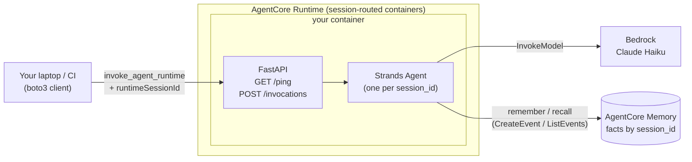

# Dessertifier — an AgentCore + Strands discovery exercise

Name a savory dish. Get back a *dessert* version of it — with every original
ingredient still intact. Anchovies stay anchovies, BBQ sauce stays BBQ sauce;
they just get candied, whipped, or folded into meringue. The results are
absurd on purpose.

The interesting bit — visible in the response so you can literally watch
it happen: **the agent has session-scoped memory it uses on its own**,
backed by AgentCore Memory. `remember` and `recall` tools let it build up
a per-session memory of your preferences and allergies that survives
container recycles and scale-out. Same session → same memory across
turns. Different session → nothing recalled. The container itself stays
effectively stateless w.r.t. durable state.

The task is silly so the fun bit is the plumbing: **you'll ship a real LLM
agent to AWS in about an hour.**

## What is all this stuff? (read this if any of these words are new)

You'll touch about ten different tools in this exercise. Here's what each one
is and why it's in the stack — you don't need to memorize this, just skim it
so nothing feels like magic.

### The agent brain

- **Amazon Bedrock** — AWS's API for calling large language models (Claude,
  Nova, Llama, etc.) without hosting them yourself. You call an HTTPS endpoint,
  AWS runs the inference, you pay per token. Our agent uses it to call Claude.
- **Claude Haiku 4.5** — the specific model we call through Bedrock. Small,
  cheap, fast. Good enough for a toy agent; you can swap in Sonnet later.
- **Strands Agents SDK** — open-source Python framework from AWS. You write
  `Agent(model=..., system_prompt=..., tools=[...])` and Strands runs the
  agent loop for you: call the model → run whichever tools the model asked
  for → feed results back → repeat until the model returns a final answer.
  This is how the agent logic fits in dozens of lines instead of hundreds.

### The plumbing around the brain

- **FastAPI** — a Python web framework. You decorate a function with
  `@app.post("/invocations")` and FastAPI turns it into an HTTP endpoint that
  can accept JSON, validate it, and return JSON. Think Flask but modern and
  async. AgentCore Runtime requires our container to expose exactly two HTTP
  routes (`GET /ping` and `POST /invocations`); FastAPI is how we do that.
- **uvicorn** — the actual web server that runs a FastAPI app. FastAPI defines
  the routes; uvicorn is what listens on port 8080 and speaks HTTP. When you
  run `uvicorn app:app`, uvicorn imports your `app.py`, finds the `app`
  object, and serves it. (In production people often put nginx or an
  Application Load Balancer in front; for AgentCore, uvicorn on its own is
  fine because AgentCore itself handles TLS and routing.)
- **Docker** — packages our code + Python + its dependencies into a single
  portable image. AgentCore Runtime pulls that image and runs it as a
  container. `Dockerfile` describes what goes in.
- **`docker buildx` + ARM64** — AgentCore Runtime only accepts `linux/arm64`
  images (cheaper compute). Most laptops and Codespaces are x86_64, so we
  need cross-architecture builds. `buildx` is Docker's cross-build system;
  under the hood it uses QEMU to emulate ARM64. First build is slow (~3–5
  min), then it caches.
- **ECR (Elastic Container Registry)** — AWS's private Docker registry.
  You push an image here; AgentCore Runtime pulls it from here. It's just
  Docker Hub, but inside your AWS account.
- **Amazon Bedrock AgentCore Runtime** — a serverless container host purpose-
  built for agents. You give it "here's my image in ECR" and it handles
  running the container, scaling it, terminating it when idle, TLS, auth,
  logging, session routing. You never SSH into a box. The contract with your
  container is minimal: expose `POST /invocations` and `GET /ping` on port
  8080, that's it.
- **Amazon Bedrock AgentCore Memory** — the managed durable state store
  that goes with AgentCore Runtime. You get a `memoryId`, then use the
  `CreateEvent` / `ListEvents` / `RetrieveMemoryRecords` APIs to persist
  facts about a session (or user, or actor) that survive container
  recycles and scale-out. Our `remember` and `recall` tools call into it.
- **Terraform** (the `aws` provider) — infrastructure as code. Instead of
  clicking around the AWS console, you describe the resources you want
  (an IAM role, an AgentCore runtime, etc.) in `.tf` files and Terraform
  makes reality match. `aws_bedrockagentcore_agent_runtime` is the specific
  resource type we deploy. This is how you ship agents at work.
- **boto3** — the official Python SDK for AWS. Every AWS API has a boto3
  client. We use `boto3.client("bedrock-agentcore")` to actually invoke our
  deployed agent from a Python script.
- **CloudWatch Logs** — AWS's log aggregator. Anything your container writes
  to stdout/stderr ends up in a CloudWatch log group. We tail it with
  `aws logs tail --follow` to watch requests in real time.

By the end you'll have deployed a containerized agent, invoked it from the
CLI, watched the logs in CloudWatch, and torn it all down. Every piece here
is what teams actually use in production agent deployments.

---

## Prerequisites (5 min)

Before you touch anything:

1. **Open this repo in your Codespace.**

2. **Pick your unique per-student suffix.** Every attendee deploys into the
   same shared AWS account, so every ECR repo, IAM role, and AgentCore
   runtime is scoped by a per-student suffix. Pick your initials plus
   something distinctive — letters, digits, or underscores only, no hyphens,
   max 16 chars. Then export it in your shell so every command below picks
   it up:
   ```bash
   export SUFFIX=gb42              # your initials + something clever
   export TF_VAR_suffix=$SUFFIX    # Terraform reads TF_VAR_* automatically
   ```
   Every `${SUFFIX}` in this doc expands to the value you just set. If you
   open a fresh terminal, re-export both variables.

3. **Install the AWS CLI v2.** The Codespace base image doesn't ship it. In
   the Codespace terminal:
   ```bash
   cd /tmp
   curl "https://awscli.amazonaws.com/awscli-exe-linux-x86_64.zip" -o "awscliv2.zip"
   unzip awscliv2.zip
   sudo ./aws/install
   ```
   Verify:
   ```bash
   aws --version    # aws-cli/2.x.x
   ```

4. **Install Terraform.** Not shipped in the base image either. Grab a
   recent Linux amd64 build from HashiCorp:
   ```bash
   cd /tmp
   TF_VERSION=1.9.8
   curl -fsSL "https://releases.hashicorp.com/terraform/${TF_VERSION}/terraform_${TF_VERSION}_linux_amd64.zip" -o terraform.zip
   unzip terraform.zip
   sudo mv terraform /usr/local/bin/
   ```
   Verify:
   ```bash
   terraform version    # Terraform v1.9.8
   ```

5. **Configure AWS credentials.**
   ```bash
   aws configure                     # region: us-east-1 is safest for Bedrock
   aws sts get-caller-identity       # sanity check
   ```

6. **Sanity-check the rest of the toolchain** (preinstalled by the
   devcontainer):
   ```bash
   docker buildx version    # buildx (for ARM64 builds)
   python3 --version        # >= 3.11
   ```

> **Cost warning:** ECR storage is cents. AgentCore charges per invocation.
> Claude Haiku is ~$0.0001 per short call. If you finish the exercise and run
> the cleanup at the end, total spend is under $0.10. **Don't skip cleanup.**

---

## The mental model (2 min — read this before you start)



Your container speaks HTTP on `POST /invocations` and `GET /ping`.
Everything else — TLS, auth, logging, autoscaling, session-based routing —
is AgentCore's problem. We use **FastAPI** for those two endpoints and
**Strands** as the agent brain behind them. Durable state (the user's
remembered facts per `session_id`) lives in **AgentCore Memory**, not in
the container, so it survives idle recycles and scale events. The
container keeps only the current chat's in-flight message history in a
per-session `Agent` object; if the container is recycled mid-chat, only
that ephemeral scratchpad is lost — every remembered fact is still there.

---

## Step 1 — Build the agent locally (20 min)

The whole agent is in [`agent/app.py`](agent/app.py). Read it — it's around
130 lines, most of which are docstrings and the system prompt. The important
bits:

- `FastAPI()` with two routes: `GET /ping` (health check) and `POST /invocations`
  (the actual work). These are the two routes AgentCore requires.
- `Agent(model=..., system_prompt=..., tools=[...])` — the Strands agent
  object. Strands runs the tool loop inside it.
- `@tool` — decorator that exposes a plain Python function to the LLM. The
  docstring is what the model sees when deciding whether to call the tool.
- `_memory = boto3.client("bedrock-agentcore")` — the AgentCore Memory
  data-plane client. `MEMORY_ID` is passed in via env var by Terraform.
- `_remember_fact` / `_recall_facts` — thin wrappers around `create_event`
  / `list_events`, keyed by `session_id` (which we use as both `actorId`
  and `sessionId` for the workshop). They also have a plain-dict fallback
  for local `uvicorn` runs where `MEMORY_ID` isn't set.
- `_make_session_tools(session_id)` — builds `remember` and `recall` as
  closures over the current `session_id` so the model can't accidentally
  leak facts across sessions.
- `_sessions: dict[str, Agent]` — the container's only in-memory state:
  the current chat's Strands Agent (with its in-flight message history).
  Ephemeral by design — dies on container recycle, but every remembered
  fact survives externally in AgentCore Memory.

### Run it locally

Before you start: **this local run isn't an agent anyone else can use.**
It's a Python web server on your Codespace, bound to a port only you can
reach — no public URL, no auth, no persistence across container restarts,
no session-routed replicas. Great for confirming the code works before we
ship it. To turn it into something the rest of the world (or even a
teammate) can call, you have to package it into a container (Step 3) and
hand it to AgentCore Runtime to host (Step 4). That's when it becomes a
deployed agent with a real ARN, TLS, IAM auth, and durable memory.

```bash
cd agent
python3 -m venv .venv
source .venv/bin/activate
pip install -r requirements.txt

uvicorn app:app --host 0.0.0.0 --port 8080 &
# ↑ MEMORY_ID isn't set locally so remember/recall use an in-process dict
#   fallback — enough to see the loop work. The deployed runtime (Step 4)
#   gets MEMORY_ID from Terraform and uses real AgentCore Memory.

# Give it a second to boot, then:
curl -s http://localhost:8080/ping                    # {"status":"Healthy"}

curl -s -X POST http://localhost:8080/invocations \
  -H 'Content-Type: application/json' \
  -d '{"message": "give me a pizza dessert", "session_id": "local-demo"}' | jq .
```

You should get back a JSON object with `reply` and — this is the important
bit — an `iterations` array. Each entry is one tool call the agent made:
what it asked, what the tool answered. Skim it:

```json
{
  "reply": "Pizza Dessert\nIngredients:\n- ...",
  "iterations": [
    {"tool": "recall", "input": {}, "output": []}
  ]
}
```

The model chose to call `recall` before answering, saw the session had no
remembered facts, then wrote the recipe. Now let's give it something to
remember. Send two messages on the same `session_id`:

```bash
# Turn 1: tell it something
curl -s -X POST http://localhost:8080/invocations -H 'Content-Type: application/json' \
  -d '{"message": "I hate coconut and I am allergic to nuts", "session_id": "local-demo"}' | jq .

# Turn 2: ask for a recipe — recall should return your two facts
curl -s -X POST http://localhost:8080/invocations -H 'Content-Type: application/json' \
  -d '{"message": "make me a pad thai dessert", "session_id": "local-demo"}' | jq .
```

In turn 1's iterations you'll see `remember → "remembered: hates coconut"`
and `remember → "remembered: allergic to nuts"`. In turn 2's iterations,
`recall` returns those two facts and the recipe avoids both. Change
`session_id` to `"other"` on turn 2 and `recall` returns `[]` — different
session, different memory. That's session affinity, visible.

Troubleshooting:

- **`AccessDeniedException`** — model access isn't enabled for your account.
  The instructor handles model access; flag it if this fires.
- **`ResourceNotFoundException: Model use case details have not been submitted`**
  — for Anthropic models on a fresh AWS account you must fill in the Anthropic
  use-case form from the Bedrock console (Model access → Anthropic → Available
  to request → fill form). Approval can take up to 15 minutes. If your account
  can't get that approved right now, temporarily point at an Amazon-owned model
  such as Nova micro with `MODEL_ID=us.amazon.nova-micro-v1:0 uvicorn ...`.
  The same fallback applies to the *deployed* runtime in Step 4 — pass the
  override as a Terraform variable:
  `terraform apply -var 'model_id=us.amazon.nova-micro-v1:0'`.
- **`ValidationException: The provided model identifier is invalid`** — the
  model ID is wrong or that inference profile isn't ACTIVE in your region.
  Run `aws bedrock list-inference-profiles --region us-east-1` to see valid
  IDs.
- **`NoCredentialsError`** — `aws configure` didn't take; check `~/.aws/credentials`.
- **Port 8080 in use** — `lsof -ti:8080 | xargs kill`.

Kill the local server before moving on. Because we launched it with `&`, the
easiest way is:

```bash
lsof -ti:8080 | xargs kill
```

(`fg` also works if the job is still attached to the current shell; on a fresh
shell it won't be.)

---

## Step 2 — Create the ECR repo (2 min)

AgentCore pulls your container from ECR, so the repo has to exist before we push
an image (and before Terraform can look it up).

```bash
aws ecr create-repository \
  --repository-name dessertifier-agent-${SUFFIX} \
  --region us-east-1
```

Confirm:

```bash
aws ecr describe-repositories --repository-names dessertifier-agent-${SUFFIX} \
  --region us-east-1 \
  --query 'repositories[0].repositoryUri' --output text
```

> Why not create the ECR repo in Terraform? Because the runtime resource needs
> to reference an image *digest* that already exists. Building the image would
> then depend on ECR, and Terraform would depend on the built image — that's a
> circular dependency in a single stack. Externally-managed ECR keeps the flow
> linear: **repo → push image → terraform apply**.

---

## Step 3 — Build and push the ARM64 image (10 min)

**AgentCore Runtime only accepts `linux/arm64` images.** Codespaces are x86_64,
so we use `docker buildx` with QEMU emulation. The first build is slow (~3–5 min
because layers are cold); subsequent ones are fast.

The build script reads your exported `SUFFIX` and pushes to
`dessertifier-agent-${SUFFIX}`:

```bash
cd ..
./scripts/build-and-push.sh
```

The script:
1. Logs docker into ECR with a temporary token.
2. Creates a buildx builder (idempotent).
3. Runs `docker buildx build --platform linux/arm64 --push`.

Verify the image made it:

```bash
aws ecr list-images --repository-name dessertifier-agent-${SUFFIX} --region us-east-1
```

---

## Step 4 — Deploy the AgentCore Runtime (10 min)

Now Terraform can reference an image that actually exists.

```bash
cd terraform
terraform init     # pulls the aws provider (a few hundred MB) on first run
terraform apply
```

### While apply runs, read `main.tf`. Pay attention to:

- **The trust policy** on `aws_iam_role.runtime` — only the AgentCore
  service (`bedrock-agentcore.amazonaws.com`) can assume the role.
- **The image URI** — pinned by *digest*, not tag. When you re-push a new image,
  the `data.aws_ecr_image` re-reads the digest and Terraform sees a diff, which
  forces a runtime update. If you used `:latest` directly, Terraform would never
  notice.
- **`aws_bedrockagentcore_memory.sessions`** — the durable facts store
  the agent's `remember`/`recall` tools call into. Its `id` is injected
  into the container as `MEMORY_ID` via `environment_variables`, and its
  ARN is scoped in the runtime role's `Memory` IAM statement.
- **`bedrock-agentcore:GetWorkloadAccessToken*`** — required so the runtime can
  talk to the AgentCore control plane on your behalf.

Apply usually takes ~2 min (runtime provisioning). If it fails with
`CREATE_FAILED`, the usual culprits are:

- Image is x86_64 not arm64 — re-run `build-and-push.sh` after fixing.
- Runtime role missing ECR perms — check the ECR statements in `main.tf`.
- Runtime name collision — someone else in the workshop grabbed the same
  `SUFFIX`; pick a new one, re-export, and re-run from Step 2.
- **`Role validation failed ... trust policy allows assumption by this
  service`** — an IAM propagation race. The `aws` provider retries this
  internally, but if it exhausts retries just run `terraform apply` again.

When it finishes:

```bash
terraform output
```

Copy the `agent_runtime_arn` value. That's what you invoke.

---

## Step 5 — Invoke the deployed agent (5 min)

```bash
cd ..
# Re-activate the venv you made in Step 1 if you're in a fresh shell:
#   source agent/.venv/bin/activate
pip install --upgrade boto3     # need a recent version for bedrock-agentcore
python3 scripts/invoke.py "give me a pizza dessert"
python3 scripts/invoke.py "bbq ribs dessert please"
python3 scripts/invoke.py "I am allergic to nuts. Make me a beef bourguignon dessert."
```

`invoke.py` sends one message with a fresh throwaway `session_id` per call
(so nothing persists between runs — for that, see the chat REPL below).
It prints the agent loop to stderr before the reply — one line per tool
call — so you can see the agent working, e.g.:

```
Agent loop — 2 tool call(s):
  1. remember → remembered: allergic to nuts
  2. recall → recalled 1 fact(s): ['allergic to nuts']

Beef Bourguignon Dessert
Ingredients:
- ...
```

Redirect stderr away (`2>/dev/null`) if you just want the reply. `--session`
lets you pin a session name if you want to hit the same container twice.

> **Gotcha:** a session id is sticky to the runtime version it first hit. If
> you re-`apply` Terraform with a new `model_id` (or otherwise create a new
> runtime version) and immediately re-invoke with the same `--session` value,
> the request may still be routed to the *previous* container. Pass a fresh
> `--session my-new-name` after any config change to force a new container.

Tail the CloudWatch logs in another shell while you invoke. The log group
includes the runtime's short ID (from `terraform output agent_runtime_id`)
plus `-DEFAULT`:

```bash
RUNTIME_ID=$(cd terraform && terraform output -raw agent_runtime_id)
aws logs tail "/aws/bedrock-agentcore/runtimes/${RUNTIME_ID}-DEFAULT" \
  --region us-east-1 --follow
```

You'll see the FastAPI request line, the Strands model call, the tool
invocation, and the response — the exact same log stream you'd get running it
locally, just on someone else's box.

### Chat with the agent (multi-turn + session memory)

`invoke.py` sends one shot on a throwaway session. For an actual
conversation where the agent remembers what you told it, use:

```bash
python3 scripts/recipechat.py
```

AgentCore routes every turn for the same `runtimeSessionId` to the same
container instance so the current chat's Strands `Agent` (message history
in flight) stays warm across turns. Facts you tell it go through
`remember` → `create_event` into AgentCore Memory, keyed by `session_id`.
Different `session_id` → different actor in AgentCore Memory → nothing
`recall`ed. Try:

```
you > I am allergic to nuts and I hate coconut
[agent loop: 2 tool call(s)]
  1. remember → remembered: allergic to nuts
  2. remember → remembered: dislikes coconut
Noted — I'll avoid nuts and coconut in every recipe this session.

you > pizza
[agent loop: 1 tool call(s)]
  1. recall → recalled 2 fact(s): ['allergic to nuts', 'dislikes coconut']
Pizza Dessert
Ingredients:
- (no nuts, no coconut, all pizza ingredients present)
...

you > now do bbq ribs
[agent loop: 1 tool call(s)]
  1. recall → recalled 2 fact(s): [...]     ← same session, same memory
```

Open a second `recipechat.py` in another terminal and ask for the same
recipes — `recall` returns `[]` because it's a fresh `session_id` and
AgentCore Memory has no events for it. Kill and restart your first REPL
and its `recall` still returns the original facts, even though the
container may have handed you a new Strands `Agent`: the durable state
lives in AgentCore Memory, not in the container.

---

## Step 6 — Clean up (5 min) **DO NOT SKIP**

```bash
cd terraform
terraform destroy
```

Then delete the ECR repo (Terraform doesn't own it):

```bash
aws ecr delete-repository \
  --repository-name dessertifier-agent-${SUFFIX} \
  --region us-east-1 \
  --force
```

Confirm nothing is left:

```bash
aws bedrock-agentcore-control list-agent-runtimes \
  --region us-east-1 \
  --query 'agentRuntimes[].agentRuntimeName'
aws ecr describe-repositories \
  --region us-east-1 \
  --query 'repositories[].repositoryName' 2>/dev/null
```

Neither should contain anything starting with `dessertifier`.

---

## Extensions (if you finish early)

Pick one, get it working, share with the class:

1. **Add a verification-loop tool.** Right now the model tries to keep every
   savory ingredient in the dessert version but nothing enforces it — it
   often quietly drops the unpleasant ones. Write `@tool def
   check_ingredients(recipe: str, ingredients: list[str])` that returns
   which ingredients from the savory original are missing from the recipe,
   and update the system prompt so the agent must call it and loop until
   nothing is missing. Watch the `iterations` array grow. This is the
   classic "tool tells ground truth, agent iterates" pattern.
2. **Swap the model.** `main.tf` passes `MODEL_ID` as an env var to the
   container, and the `model_id` Terraform variable controls it. Try
   `terraform apply -var 'model_id=us.anthropic.claude-sonnet-4-5-20250929-v1:0'`
   — no rebuild needed. Compare quality vs. latency vs. cost.
3. **Stream responses.** FastAPI supports `StreamingResponse`; Strands supports
   `agent.stream_async(...)`. Change the invoke script to print tokens as they
   arrive.
4. **Cross-session memory via user id.** Session memory is already in
   AgentCore Memory but keyed by `session_id`, so switching sessions
   wipes the recall. Add a `user_id` to the payload and use that as the
   `actorId` in `create_event` / `list_events`. Same user across two
   sessions will now share facts. Bonus: wire in a `USER_PREFERENCE`
   [memory strategy](https://docs.aws.amazon.com/bedrock-agentcore/latest/devguide/memory.html)
   so extracted preferences become semantically searchable.
5. **Add a second toy agent.** An `Emojifier` (rewrites text to contain
   exactly N emojis, tool: `count_emojis(text)`, loop until the count is
   exact). Same pattern, ten minutes. Second Docker image, second runtime
   resource in Terraform.

---

## Reference — file layout

```
.
├── README.md
├── agent/
│   ├── app.py                  # FastAPI + Strands agent
│   ├── requirements.txt
│   └── Dockerfile              # ARM64, uvicorn on :8080
├── terraform/
│   ├── versions.tf             # aws provider (~> 6.0)
│   ├── variables.tf
│   ├── main.tf                 # IAM role, AgentCore Runtime, image lookup
│   └── outputs.tf
├── scripts/
│   ├── build-and-push.sh       # buildx → ECR
│   ├── invoke.py               # single-shot boto3 call to the deployed runtime
│   └── recipechat.py           # multi-turn REPL (same runtime, session-persistent)
└── .gitignore
```

## Reference — docs to read after class

- Strands Agents: <https://strandsagents.com/>
- AgentCore Runtime: <https://docs.aws.amazon.com/bedrock-agentcore/latest/devguide/runtime.html>
- Bedrock model catalog: <https://docs.aws.amazon.com/bedrock/latest/userguide/models-supported.html>
