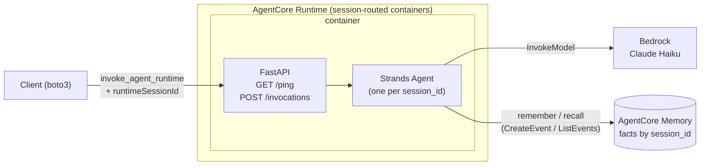

# Dessertifier — an AgentCore and Strands exercise

Given the name of a savory dish, the agent returns a dessert version of the
same dish while retaining every ingredient from the original. Anchovies
remain anchovies; barbecue sauce remains barbecue sauce; ingredients are
candied, whipped, or folded into meringue rather than substituted.

The agent maintains session-scoped memory through Amazon Bedrock AgentCore
Memory. Two tools — `remember` and `recall` — persist and retrieve
per-session facts (dietary preferences, allergies, stylistic constraints)
that survive container recycles and scale events. Requests carrying the
same `session_id` share memory; different values are isolated. The
container itself holds no durable state.

The task is deliberately trivial. The purpose of the exercise is to walk
through a complete deployment of an LLM agent to AWS in approximately one
hour.

## Components

The exercise involves roughly ten distinct components. Prior familiarity is
not required; the summary below is provided for reference.

### Model and agent framework

- **Amazon Bedrock** — an AWS service that exposes large language models
  (Claude, Nova, Llama, and others) through an HTTPS API. Inference is
  managed by AWS and billed per token. The agent calls Claude through
  Bedrock.
- **Claude Haiku 4.5** — the specific model invoked through Bedrock. It is
  small, inexpensive, and low-latency, and is sufficient for this exercise.
  Larger models such as Claude Sonnet can be substituted later.
- **Strands Agents SDK** — an open-source Python framework maintained by
  AWS. Instantiating `Agent(model=..., system_prompt=..., tools=[...])`
  produces an agent that runs the standard tool loop: invoke the model,
  execute any requested tools, feed results back, and repeat until the
  model produces a final answer. Strands keeps the agent implementation
  short.

### Runtime and infrastructure

- **FastAPI** — a Python web framework. Endpoints declared with decorators
  such as `@app.post("/invocations")` are exposed as HTTP routes with JSON
  validation. AgentCore Runtime requires the container to expose exactly
  two endpoints (`GET /ping` and `POST /invocations`); FastAPI provides
  them.
- **uvicorn** — the ASGI server that hosts the FastAPI application.
  Running `uvicorn app:app` imports `app.py` and serves the `app` object
  on port 8080. AgentCore terminates TLS and handles routing externally,
  so no additional web server is required.
- **Docker** — packages the application, Python runtime, and dependencies
  into a portable image. AgentCore Runtime pulls the image and runs it as
  a container. The `Dockerfile` describes its contents.
- **`docker buildx` with ARM64** — AgentCore Runtime accepts only
  `linux/arm64` images. Most development machines are `x86_64`, so
  cross-architecture builds are required. `docker buildx` performs
  cross-builds using QEMU emulation. The first build takes several
  minutes; subsequent builds are cached.
- **Amazon Elastic Container Registry (ECR)** — AWS's private container
  registry. Images are pushed to ECR and pulled from ECR by AgentCore
  Runtime.
- **Amazon Bedrock AgentCore Runtime** — a serverless container host
  designed for agents. Given an image reference in ECR, it manages the
  container lifecycle, scaling, idle termination, TLS, authentication,
  logging, and session-based routing. The container's only responsibility
  is to expose `POST /invocations` and `GET /ping` on port 8080.
- **Amazon Bedrock AgentCore Memory** — a managed durable state store
  associated with AgentCore Runtime. It exposes `CreateEvent`,
  `ListEvents`, and `RetrieveMemoryRecords` operations for persisting
  facts scoped by session, user, or actor identifier. The `remember` and
  `recall` tools invoke this service.
- **Terraform (AWS provider)** — declarative infrastructure as code. AWS
  resources are described in `.tf` files and reconciled by Terraform. The
  `aws_bedrockagentcore_agent_runtime` resource is the entry point for
  deployment.
- **boto3** — the official Python SDK for AWS. The exercise invokes the
  deployed agent using `boto3.client("bedrock-agentcore")`.
- **Amazon CloudWatch Logs** — AWS's log aggregation service. Container
  output on stdout and stderr is collected into a CloudWatch log group and
  can be streamed with `aws logs tail --follow`.

The exercise concludes with a containerized agent deployed to AWS, invoked
from the command line, monitored through CloudWatch, and then removed.
Each component is representative of a production agent deployment.

---

## Prerequisites (5 minutes)

Before beginning:

1. **Open the repository in your Codespace.**

2. **Choose a per-student suffix.** All attendees deploy into a shared AWS
   account, so each ECR repository, IAM role, and AgentCore runtime is
   scoped by a per-student suffix. Use your initials plus a distinctive
   fragment — letters, digits, or underscores only, no hyphens, maximum
   16 characters. Export it so subsequent commands inherit the value:
   ```bash
   export SUFFIX=gb42              # initials plus additional identifier
   export TF_VAR_suffix=$SUFFIX    # Terraform reads TF_VAR_* automatically
   ```
   Every `${SUFFIX}` in this document expands to the exported value.
   Re-export both variables in any new terminal.

3. **Install AWS CLI v2.** The Codespace base image does not include it:
   ```bash
   cd /tmp
   curl "https://awscli.amazonaws.com/awscli-exe-linux-x86_64.zip" -o "awscliv2.zip"
   unzip awscliv2.zip
   sudo ./aws/install
   ```
   Verify:
   ```bash
   aws --version    # aws-cli/2.x.x
   ```

4. **Install Terraform.** Also not included in the base image. Download a
   recent Linux `amd64` build from HashiCorp:
   ```bash
   cd /tmp
   TF_VERSION=1.9.8
   curl -fsSL "https://releases.hashicorp.com/terraform/${TF_VERSION}/terraform_${TF_VERSION}_linux_amd64.zip" -o terraform.zip
   unzip terraform.zip
   sudo mv terraform /usr/local/bin/
   ```
   Verify:
   ```bash
   terraform version    # Terraform v1.9.8
   ```

5. **Configure AWS credentials.**
   ```bash
   aws configure                     # region: us-east-1 recommended for Bedrock
   aws sts get-caller-identity       # verification
   ```

6. **Verify the remaining tooling** (installed by the devcontainer):
   ```bash
   docker buildx version    # buildx (required for ARM64 builds)
   python3 --version        # 3.11 or later
   ```

> **Cost note:** ECR storage is on the order of cents. AgentCore is billed
> per invocation. Claude Haiku costs approximately $0.0001 per short call.
> Completing the exercise and running the cleanup at the end results in
> total spend under $0.10. **Cleanup is mandatory.**

---

## Architecture (2 minutes)



The container serves `POST /invocations` and `GET /ping` over HTTP. TLS
termination, authentication, logging, autoscaling, and session-based
routing are handled by AgentCore. **FastAPI** provides the HTTP endpoints;
**Strands** implements the agent loop. Durable state — the user's
remembered facts per `session_id` — is stored in **AgentCore Memory**,
not in the container, and therefore survives idle recycles and scale
events. The container retains only the current conversation's in-flight
message history in a per-session `Agent` object; if the container is
recycled mid-conversation, that ephemeral state is lost while every
remembered fact is preserved externally.

---

## Step 1 — Build the agent locally (20 minutes)

The complete agent is defined in [`agent/app.py`](agent/app.py) —
approximately 130 lines, the majority of which are docstrings and the
system prompt. The key elements:

- `FastAPI()` with two routes: `GET /ping` (health check) and
  `POST /invocations` (request handler). These are the two routes required
  by AgentCore.
- `Agent(model=..., system_prompt=..., tools=[...])` — the Strands agent
  object. The tool loop runs inside it.
- `@tool` — decorator that exposes a Python function to the model. The
  function's docstring is what the model consults when deciding whether to
  invoke the tool.
- `_memory = boto3.client("bedrock-agentcore")` — the AgentCore Memory
  data-plane client. `MEMORY_ID` is supplied through an environment
  variable by Terraform.
- `_remember_fact` and `_recall_facts` — thin wrappers around
  `create_event` and `list_events`, keyed by `session_id` (used as both
  `actorId` and `sessionId` for this exercise). A plain-dictionary
  fallback is included for local `uvicorn` runs where `MEMORY_ID` is not
  set.
- `_make_session_tools(session_id)` — constructs `remember` and `recall`
  as closures over the current `session_id`, preventing accidental
  cross-session leakage.
- `_sessions: dict[str, Agent]` — the container's only in-memory state,
  holding the current conversation's Strands `Agent`. This state is
  ephemeral by design: it is discarded on container recycle, while every
  remembered fact persists externally in AgentCore Memory.

### Running the agent locally

The local process is not a deployed agent. It is a Python web server bound
to a port accessible only within your Codespace — no public URL, no
authentication, no persistence across restarts, no session-routed
replicas. Its purpose is to verify that the code runs correctly before
packaging. Turning it into a service that others can invoke requires
packaging it into a container (Step 3) and hosting it through AgentCore
Runtime (Step 4), at which point it acquires an ARN, TLS, IAM
authentication, and durable memory.

```bash
cd agent
python3 -m venv .venv
source .venv/bin/activate
pip install -r requirements.txt

uvicorn app:app --host 0.0.0.0 --port 8080 &
# MEMORY_ID is unset locally, so remember/recall use an in-process
# dictionary fallback — sufficient to exercise the loop. The deployed
# runtime (Step 4) receives MEMORY_ID from Terraform and uses AgentCore
# Memory directly.

# After a brief delay:
curl -s http://localhost:8080/ping                    # {"status":"Healthy"}

curl -s -X POST http://localhost:8080/invocations \
  -H 'Content-Type: application/json' \
  -d '{"message": "give me a pizza dessert", "session_id": "local-demo"}' | jq .
```

The response is a JSON object containing `reply` and an `iterations`
array. Each entry corresponds to one tool call made by the agent,
recording the input and output:

```json
{
  "reply": "Pizza Dessert\nIngredients:\n- ...",
  "iterations": [
    {"tool": "recall", "input": {}, "output": []}
  ]
}
```

The model called `recall` before answering, observed that the session held
no remembered facts, and then produced the recipe. To exercise
persistence, send two messages with the same `session_id`:

```bash
# Turn 1: assert preferences
curl -s -X POST http://localhost:8080/invocations -H 'Content-Type: application/json' \
  -d '{"message": "I hate coconut and I am allergic to nuts", "session_id": "local-demo"}' | jq .

# Turn 2: request a recipe — recall returns the two facts
curl -s -X POST http://localhost:8080/invocations -H 'Content-Type: application/json' \
  -d '{"message": "make me a pad thai dessert", "session_id": "local-demo"}' | jq .
```

In turn 1's `iterations`, `remember` is invoked twice, returning
`"remembered: hates coconut"` and `"remembered: allergic to nuts"`. In
turn 2's `iterations`, `recall` returns both facts and the recipe honors
both constraints. Substituting `"other"` for `session_id` in turn 2 causes
`recall` to return `[]`, demonstrating session isolation.

Troubleshooting:

- **`AccessDeniedException`** — model access has not been enabled for the
  account. Model access is managed by the instructor; report the error.
- **`ResourceNotFoundException: Model use case details have not been submitted`**
  — for Anthropic models on a new AWS account, the Anthropic use-case form
  must be submitted from the Bedrock console (Model access → Anthropic →
  Available to request → complete form). Approval can take up to 15
  minutes. As a workaround, an Amazon-owned model such as Nova Micro can
  be used: `MODEL_ID=us.amazon.nova-micro-v1:0 uvicorn ...`. The same
  override applies to the deployed runtime in Step 4 through a Terraform
  variable: `terraform apply -var 'model_id=us.amazon.nova-micro-v1:0'`.
- **`ValidationException: The provided model identifier is invalid`** —
  the model identifier is incorrect or the inference profile is not
  `ACTIVE` in the current region. Run
  `aws bedrock list-inference-profiles --region us-east-1` to list valid
  identifiers.
- **`NoCredentialsError`** — `aws configure` did not persist credentials;
  verify `~/.aws/credentials`.
- **Port 8080 already bound** — `lsof -ti:8080 | xargs kill`.

Terminate the local server before continuing. Because it was launched with
`&`:

```bash
lsof -ti:8080 | xargs kill
```

(`fg` also works if the job remains attached to the current shell.)

---

## Step 2 — Create the ECR repository (2 minutes)

AgentCore pulls the container from ECR, so the repository must exist
before an image is pushed and before Terraform can reference it.

```bash
aws ecr create-repository \
  --repository-name dessertifier-agent-${SUFFIX} \
  --region us-east-1
```

Verify:

```bash
aws ecr describe-repositories --repository-names dessertifier-agent-${SUFFIX} \
  --region us-east-1 \
  --query 'repositories[0].repositoryUri' --output text
```

> The ECR repository is not managed by Terraform because the AgentCore
> runtime resource references an image *digest* that must already exist.
> Building the image would depend on ECR, and Terraform would depend on
> the built image — a cycle within a single stack. Managing ECR outside
> Terraform keeps the flow linear: **repository → image push → terraform
> apply**.

---

## Step 3 — Build and push the ARM64 image (10 minutes)

**AgentCore Runtime accepts only `linux/arm64` images.** Codespaces are
`x86_64`, so `docker buildx` with QEMU emulation is used. The first build
is slow (approximately 3–5 minutes because layers are cold); subsequent
builds are fast.

The build script reads the exported `SUFFIX` and pushes to
`dessertifier-agent-${SUFFIX}`:

```bash
cd ..
./scripts/build-and-push.sh
```

The script:
1. Authenticates Docker with ECR using a temporary token.
2. Creates a `buildx` builder (idempotent).
3. Runs `docker buildx build --platform linux/arm64 --push`.

Verify that the image was pushed:

```bash
aws ecr list-images --repository-name dessertifier-agent-${SUFFIX} --region us-east-1
```

---

## Step 4 — Deploy the AgentCore Runtime (10 minutes)

Terraform can now reference an image that exists in ECR.

Open [`terraform/main.tf`](terraform/main.tf) before applying. The resource
shapes are conventional AWS: an IAM role with a trust policy and a policy
document with SIDs (ECR pull, CloudWatch Logs, `bedrock:InvokeModel`,
memory access), an ECR image lookup, and AgentCore Runtime and AgentCore
Memory resources. The same AWS primitives are used, expressed in HCL
rather than through the console.

```bash
cd terraform
terraform init     # downloads the aws provider (several hundred MB) on first run
terraform apply
```

### While the apply runs, review `main.tf`. Points of interest:

- **The trust policy** on `aws_iam_role.runtime`: only the AgentCore
  service (`bedrock-agentcore.amazonaws.com`) can assume the role.
- **The image URI**: pinned by *digest*, not by tag. When a new image is
  pushed, `data.aws_ecr_image` re-reads the digest and Terraform detects a
  diff, forcing a runtime update. Referencing `:latest` directly would
  prevent Terraform from noticing changes.
- **`aws_bedrockagentcore_memory.sessions`**: the durable facts store that
  `remember` and `recall` invoke. Its `id` is injected into the container
  as `MEMORY_ID` through `environment_variables`, and its ARN is scoped
  in the runtime role's `Memory` IAM statement.
- **`bedrock-agentcore:GetWorkloadAccessToken*`**: required for the
  runtime to communicate with the AgentCore control plane on the caller's
  behalf.

Apply typically completes in approximately 2 minutes (runtime
provisioning). If `CREATE_FAILED` occurs, common causes are:

- Image built for `x86_64` rather than `arm64` — re-run
  `build-and-push.sh` after correction.
- Runtime role missing ECR permissions — verify the ECR statements in
  `main.tf`.
- Runtime name collision — the same `SUFFIX` is already in use by another
  attendee; select a new value, re-export, and repeat from Step 2.
- **`Role validation failed ... trust policy allows assumption by this
  service`** — an IAM propagation race. The `aws` provider retries
  internally; if retries are exhausted, re-run `terraform apply`.

On success:

```bash
terraform output
```

Record the `agent_runtime_arn` value; it is the identifier used to invoke
the agent.

---

## Step 5 — Invoke the deployed agent (5 minutes)

The deployed runtime is an AWS API; the AWS CLI is sufficient to invoke
it, without any Python:

```bash
cd ..
ARN=$(cd terraform && terraform output -raw agent_runtime_arn)
SESSION=cli-workshop-session-000000000000000    # arbitrary string, 33+ characters

# Payload must be provided as a blob; write it to a file.
cat > /tmp/payload.json <<EOF
{"message": "I am allergic to nuts. Give me a pizza dessert.", "session_id": "$SESSION"}
EOF

aws bedrock-agentcore invoke-agent-runtime \
  --agent-runtime-arn "$ARN" \
  --runtime-session-id "$SESSION" \
  --payload fileb:///tmp/payload.json \
  --region us-east-1 \
  /tmp/response.json

jq . /tmp/response.json
```

The response has the same JSON structure as the local `curl` output in
Step 1 — a `reply` field and an `iterations` array recording every
`remember` and `recall` call the agent made before answering. Re-running
the same command with the same `$SESSION` causes `recall` to return the
nut-allergy fact stored on the first invocation, demonstrating that
AgentCore Memory is persisting session-scoped state.

Notes on the CLI form:

- **`runtime-session-id` must be at least 33 characters.** Shorter values
  are rejected by AgentCore.
- **`--payload` must be a blob**, hence `fileb://<path>`. Inline JSON as a
  string is also accepted but requires more careful quoting.
- **The response body is written to a positional outfile**
  (`/tmp/response.json`); stdout carries metadata only.

> **Note:** a session identifier is sticky to the runtime version it first
> reaches. Re-running `terraform apply` with a new `model_id` (or
> otherwise creating a new runtime version) and immediately re-invoking
> with the same session identifier may still route the request to the
> previous container. Use a fresh session identifier after any
> configuration change to force a new container.

To tail the CloudWatch logs from a second shell during invocation, use the
log group name derived from the runtime's short identifier
(`terraform output agent_runtime_id`) with the `-DEFAULT` suffix:

```bash
RUNTIME_ID=$(cd terraform && terraform output -raw agent_runtime_id)
aws logs tail "/aws/bedrock-agentcore/runtimes/${RUNTIME_ID}-DEFAULT" \
  --region us-east-1 --follow
```

The stream contains the FastAPI request line, the Strands model call, the
tool invocation, and the response — identical in content to a local run.

### Interactive session

The CLI form is suitable for one-shot invocations. For a multi-turn
conversation — where the agent recalls prior context and the recipe can
be iteratively refined — a REPL is more convenient. `recipechat.py` wraps
`invoke-agent-runtime` in an input loop.

Reuse the virtual environment from Step 1 (which already contains
`boto3`), or create a new one:

```bash
# Option A: reuse the Step 1 venv (boto3 already installed)
source agent/.venv/bin/activate

# Option B: fresh venv from the repository root
python3 -m venv .venv && source .venv/bin/activate && pip install boto3

# Then, in either case:
python3 scripts/recipechat.py
```

AgentCore routes every turn for the same `runtimeSessionId` to the same
container instance, so the current conversation's Strands `Agent` (with
its in-flight message history) remains available across turns. Facts
asserted by the user are persisted through `remember` → `create_event`
into AgentCore Memory, keyed by `session_id`. A different `session_id`
corresponds to a different actor in AgentCore Memory, and `recall`
returns nothing. Example:

```
you > I am allergic to nuts and I hate coconut
[agent loop: 2 tool call(s)]
  1. remember → remembered: allergic to nuts
  2. remember → remembered: dislikes coconut
Noted — I'll avoid nuts and coconut in every recipe this session.

you > pizza
[agent loop: 1 tool call(s)]
  1. recall → recalled 2 fact(s): ['allergic to nuts', 'dislikes coconut']
Pizza Dessert
Ingredients:
- (no nuts, no coconut, all pizza ingredients present)
...

you > now do bbq ribs
[agent loop: 1 tool call(s)]
  1. recall → recalled 2 fact(s): [...]     ← same session, same memory
```

Opening a second `recipechat.py` in another terminal and requesting the
same recipes causes `recall` to return `[]`, because the fresh
`session_id` has no events in AgentCore Memory. Terminating and
restarting the first REPL still returns the original facts on `recall`,
even if the container has assigned a new Strands `Agent`: durable state
resides in AgentCore Memory, not in the container.

---

## Step 6 — Clean up (5 minutes) — **DO NOT SKIP**

```bash
cd terraform
terraform destroy
```

Then delete the ECR repository (which is not managed by Terraform):

```bash
aws ecr delete-repository \
  --repository-name dessertifier-agent-${SUFFIX} \
  --region us-east-1 \
  --force
```

Confirm that no resources remain:

```bash
aws bedrock-agentcore-control list-agent-runtimes \
  --region us-east-1 \
  --query 'agentRuntimes[].agentRuntimeName'
aws ecr describe-repositories \
  --region us-east-1 \
  --query 'repositories[].repositoryName' 2>/dev/null
```

Neither result should contain any name beginning with `dessertifier`.

---

## Extensions

For attendees who finish early:

1. **Add a verification-loop tool.** As currently implemented, the model
   attempts to retain every savory ingredient in the dessert version, but
   no mechanism enforces the constraint and less palatable ingredients
   are frequently dropped. Implement
   `@tool def check_ingredients(recipe: str, ingredients: list[str])`
   returning the ingredients from the savory original that are missing
   from the recipe, and update the system prompt so the agent must invoke
   it and iterate until nothing is missing. This illustrates the
   "tool as ground truth, agent iterates" pattern.
2. **Change the model.** `main.tf` passes `MODEL_ID` to the container as
   an environment variable, controlled by the `model_id` Terraform
   variable. For example:
   `terraform apply -var 'model_id=us.anthropic.claude-sonnet-4-5-20250929-v1:0'`.
   No rebuild is required. Compare output quality, latency, and cost.
3. **Stream responses.** FastAPI supports `StreamingResponse`; Strands
   supports `agent.stream_async(...)`. Modify the invocation script to
   render tokens as they arrive.
4. **Cross-session memory keyed by user identifier.** Session memory is
   already stored in AgentCore Memory but keyed by `session_id`, so
   switching sessions loses recall. Add a `user_id` to the payload and
   use it as `actorId` in `create_event` and `list_events`. The same user
   across two sessions will then share facts. As a further extension,
   enable a `USER_PREFERENCE`
   [memory strategy](https://docs.aws.amazon.com/bedrock-agentcore/latest/devguide/memory.html)
   so extracted preferences become semantically searchable.
5. **Add a second agent.** For example, an `Emojifier` that rewrites text
   to contain exactly N emojis, using a `count_emojis(text)` tool and
   looping until the count matches. The same pattern applies: a second
   Docker image and a second runtime resource in Terraform.

---

## File layout

```
.
├── README.md
├── agent/
│   ├── app.py                  # FastAPI application and Strands agent
│   ├── requirements.txt
│   └── Dockerfile              # ARM64, uvicorn on port 8080
├── terraform/
│   ├── versions.tf             # aws provider (~> 6.0)
│   ├── variables.tf
│   ├── main.tf                 # IAM role, AgentCore Runtime, image lookup
│   └── outputs.tf
├── scripts/
│   ├── build-and-push.sh       # buildx to ECR
│   └── recipechat.py           # multi-turn chat REPL over invoke_agent_runtime
└── .gitignore
```

## Further reading

- Strands Agents: <https://strandsagents.com/>
- AgentCore Runtime: <https://docs.aws.amazon.com/bedrock-agentcore/latest/devguide/runtime.html>
- Bedrock model catalog: <https://docs.aws.amazon.com/bedrock/latest/userguide/models-supported.html>
